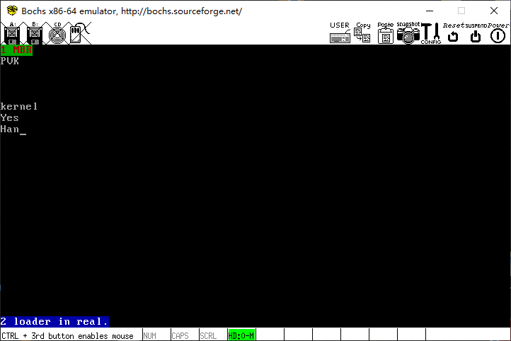

# put_char 函数的实验

## 编译和链接

#### 编译 print.s
```sh
$ nasm print.s -f elf -o print.o
```

【检查】
```sh
$ file print.o
print.o: ELF 32-bit LSB relocatable, Intel 80386, version 1 (SYSV), not stripped
```

编译 main.c
```
$ gcc main.c  -I '/path/to/your/lib/' -c -o main.o  -m32
```

【检查】
```
$ file main.o
main.o: ELF 32-bit LSB relocatable, Intel 80386, version 1 (SYSV), not stripped
```
别忘了-m32，否则就编译成64位的了。

链接：
```
$ ld -Ttext 0xc0001500 -e main main.o print.o -o kernel.bin -m elf_i386
```

【检查】
```
$ file kernel.bin
kernel.bin: ELF 32-bit LSB executable, Intel 80386, version 1 (SYSV), statically linked, not stripped
```
别忘了 -m elf_i386，不指定平台会链接失败的


-Ttext 0xc0001500指定了开始执行的地址。loader会最后跳转到这个地址哦

```
$ readelf -e kernel.bin
ELF Header:
  Magic:   7f 45 4c 46 01 01 01 00 00 00 00 00 00 00 00 00
  Class:                             ELF32
  Data:                              2's complement, little endian
  Version:                           1 (current)
  OS/ABI:                            UNIX - System V
  ABI Version:                       0
  Type:                              EXEC (Executable file)
  Machine:                           Intel 80386
  Version:                           0x1
  Entry point address:               0xc0001500
  Start of program headers:          52 (bytes into file)
  Start of section headers:          5008 (bytes into file)
  Flags:                             0x0
  Size of this header:               52 (bytes)
  Size of program headers:           32 (bytes)
  Number of program headers:         3
  Size of section headers:           40 (bytes)
  Number of section headers:         8
  Section header string table index: 7

Section Headers:
  [Nr] Name              Type            Addr     Off    Size   ES Flg Lk Inf Al
  [ 0]                   NULL            00000000 000000 000000 00      0   0  0
  [ 1] .text             PROGBITS        c0001500 000500 0001ad 00  AX  0   0 16  <-- 这里是我们写的代码所在的段, .text
  [ 2] .eh_frame         PROGBITS        c00016b0 0006b0 000054 00   A  0   0  4
  [ 3] .got.plt          PROGBITS        c0003000 001000 00000c 04  WA  0   0  4
  [ 4] .comment          PROGBITS        00000000 00100c 000029 01  MS  0   0  1
  [ 5] .symtab           SYMTAB          00000000 001038 0001c0 10      6  22  4
  [ 6] .strtab           STRTAB          00000000 0011f8 00015a 00      0   0  1
  [ 7] .shstrtab         STRTAB          00000000 001352 00003d 00      0   0  1
Key to Flags:
  W (write), A (alloc), X (execute), M (merge), S (strings), I (info),
  L (link order), O (extra OS processing required), G (group), T (TLS),
  C (compressed), x (unknown), o (OS specific), E (exclude),
  p (processor specific)

Program Headers:
  Type           Offset   VirtAddr   PhysAddr   FileSiz MemSiz  Flg Align
  LOAD           0x000000 0xc0001000 0xc0001000 0x00704 0x00704 R E 0x1000
  LOAD           0x001000 0xc0003000 0xc0003000 0x0000c 0x0000c RW  0x1000
  GNU_STACK      0x000000 0x00000000 0x00000000 0x00000 0x00000 RWE 0x10

 Section to Segment mapping:
  Segment Sections...
   00     .text .eh_frame
   01     .got.plt
   02
```

## 写硬盘

只改动了 kernel，原来的 loader 会跳转到 0xc0001500。
我们只把新的 kernel 写到硬盘。
```
$ dd if=kernel.bin of=hd60M.img bs=512 seek=9 count=200 conv=notrunc
10+1 records in
10+1 records out
5328 bytes (5.3 kB, 5.2 KiB) copied, 0.0489163 s, 109 kB/s
```

## 运行


